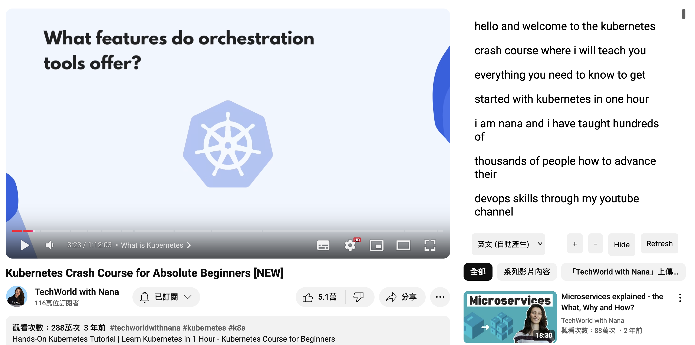

# Youtube Caption Reader

This extension display the captions of a youtube video on the side of the video. Clicking on the caption will take you to that part of the video.

## Why do we need this extension?

There are more and more videos seems to make a great point but ended up talking about something else or things that are common.

This extension allows you to skim through the video and jump to the part you are interested in. It also allows you to search for a specific word in the captions and jump to that part of the video.

## Features

- Display captions on the side of the video
- Choose the language of the captions
- Click on the caption to jump to that part of the video
- Search for a specific word in the captions and jump to that part of the video (using browser's find feature)
- Adjust the text size

Sometimes the UI may not be updated correctly. If that happens, click on the refresh button to adjust the layout.

## Things to note

There are bugs in the extension or rooms left for improvements. If you have any ideas, feel free to open an issue or a pull request. Here are some of the things that still need to be done:

- [ ] The caption scrolls as the video plays. It would be nice to have the caption that is currently being spoken to be highlighted.
- [ ] The layout of the captions is not dynamic adjusted. The refresh button needs to be clicked to adjust the layout.
- [ ] Ways to select default language or even set priority for the languages. (Currently, english is the default language)
- [ ] It is not clearly indicated that there are no captions available for the video.